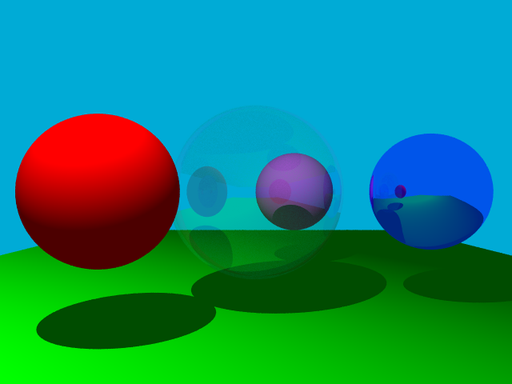

# A minimal Raytracer

A simple raytracer written in C99. It uses [tinyobjloader-c](https://github.com/syoyo/tinyobjloader-c) to load `.obj` files and [stb](https://github.com/nothings/stb) to write render result to `.png`.

